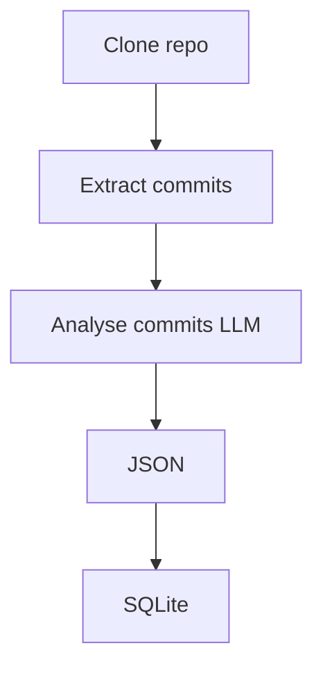

# repo analyser

Extract structured data from a GIT repository with Ollama

## Pipeline

## Usage

`./run.ts https://github.com/datagouv/udata-front`

This will fetch the repo and use your local ollama to produce files in `.repos/datagouv/udata-front/repo-output`

## Features

- generate full SQLite
- generete some basic reports
- progessive and resumeable

## Limitations

- 50 most recently updated project per organisation
- 100 last commit per repo

With time you'll get more and more commits

## Todo

- GitLab support
- parquet export
- openAI API compat

## Stack

- TypeScript
- ollama + qwen2.5
