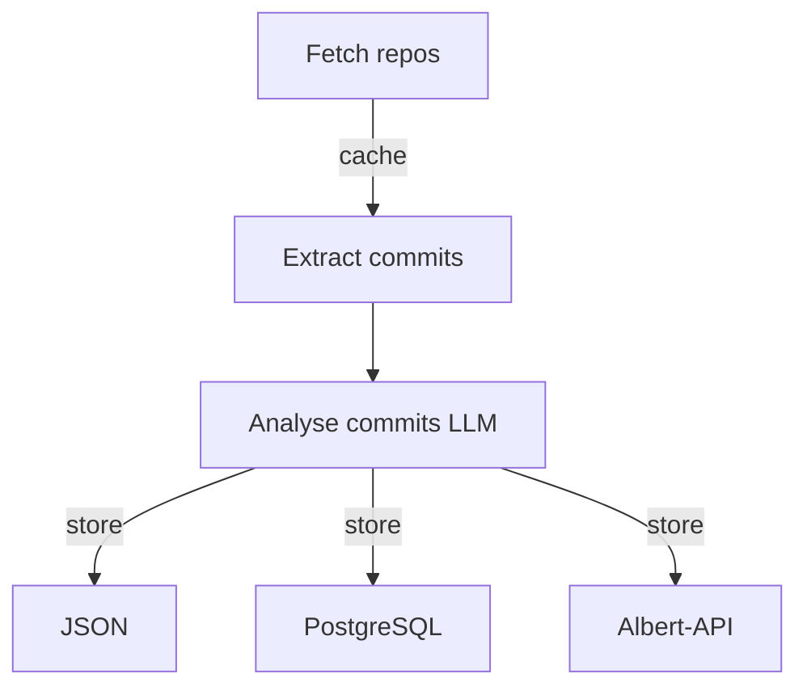

# commits extractor

Extract structured informations from your GIT repositories

## Pipeline

## Limitations

- 50 most recently updated project per organisation
- 500 last commit per repo

## Todo

- GitLab support
- repo/users exclusions
- parquet export

## Stack

- TypeScript
- ollama + qwen2.5
