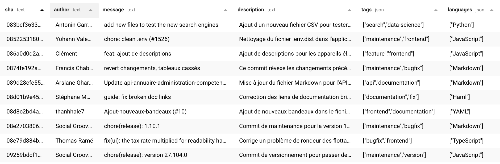

# commits

Extract structured data from a GIT repositories with Ollama and combine multiple repos data in a single SQLite file.

The sample [./commits.sqlite](./commits.sqlite) covers ~700 repositories, ~30k commits overs ~12 organisations.

This could be used to generate changelogs, dig into project activities, mix'n'match projects and authors.

## Repo pipeline (run.ts)

## Usage

You need `node@20+` to run the scripts

Clone the repo and run `yarn` to install dependencies then :

`./run.ts https://github.com/datagouv/udata-front`

This will fetch the repo and use your local ollama to produce files in `./repos/datagouv/udata-front/repo-output`

execute `./src/create-full-sqlite.ts` to compile all data in `./commits.sqlite`

Additionnal scripts are available in [./src](./src)

## Features

- progessive and resumeable
- use git diff contents and commit metadata
- generate full SQLite
- generate some basic reports

## Limitations

- 50 most recently updated project per organisation
- 50 last commit per repo

## Todo

- static demo app
- parquet export
- openAI API compat

## Stack

- TypeScript
- ollama + qwen2.5
